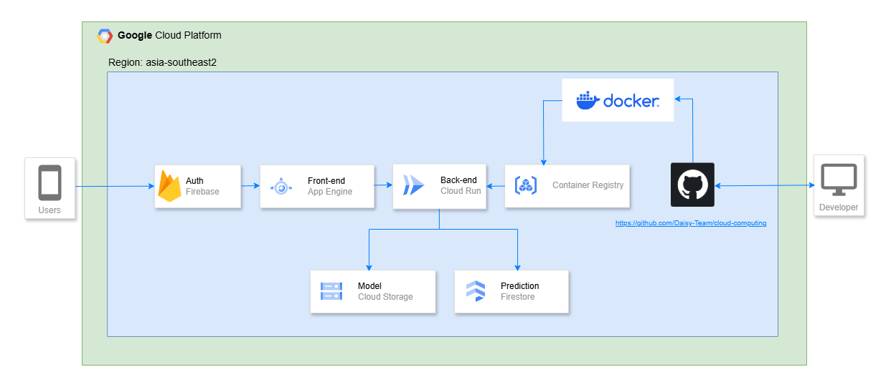

# Daisy - Cloud Computing ☁️

## 📑 Introduction

Daisy is an innovative dermatological AI system application for your skin aimed at detecting early skin diseases using image processing and machine learning. This repository contains the cloud computing components of the Daisy project, including APIs for authentication, news fetching, and machine learning model integration.

## 👨‍💻‍ Cloud Computing Team

| No. |       Member        |  Student ID  |      Path       |                                                                                 Contacts                                                                                  |
| :-: | :-----------------: | :----------: | :-------------: | :-----------------------------------------------------------------------------------------------------------------------------------------------------------------------: |
|  1  | Hafiz Aryan Siregar | C546B4NY1667 | Cloud Computing |     |
|  2  |    Hapid Ramdani    | C546B4NY1726 | Cloud Computing |  |

## 🔗 Related Project Repositories

|    Learning Paths     |                               Link                                |
| :-------------------: | :---------------------------------------------------------------: |
|  🤖 Machine Learning  |          [ML Repository](https://github.com/Daisy-Team/)          |
| 📱 Mobile Development | [MD Repository](https://github.com/Daisy-Team/mobile-development) |

## 🔎 Features

- **Authentication**: Secure user authentication using Firebase.
- **Machine Learning**: Analyze uploaded images for eye disease detection using a machine learning model.

## 🔗 APIs

### Authentication API

- **Base URL/Endpoint**: `https://asia-southeast2-inbound-decker-441613-s6.cloudfunctions.net/app`
- **Methods**:
  - `POST api/register`: Register a new user.
  - `POST api/login`: Authenticate an existing user.
  - `POST api/reset-password`: Change user password.
  - `POST api/logout`: Logging out user account

### Machine Learning API

- **Base URL/Endpoint**: `lorem ipsum`
- **Methods**:
  - `POST /image`: Analyze the uploaded image for skin disease detection.

### Daisy Architecture

